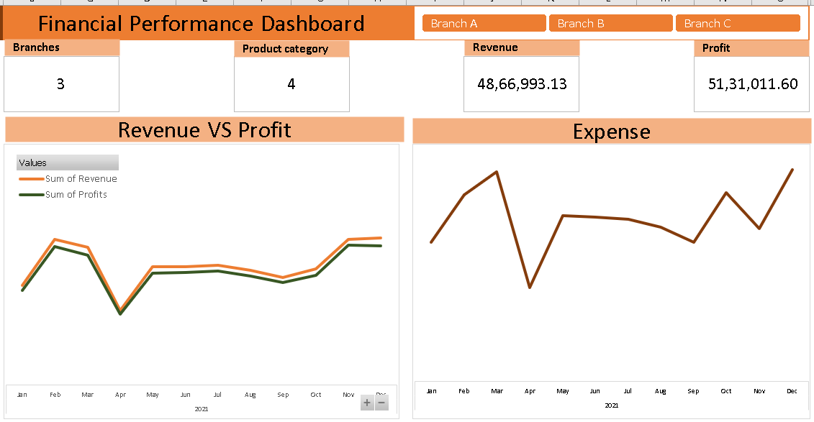

# Excel Pivot Dashboards
 **Data analysis with Evergreen tool, MS Excel**

Case Study: Optimizing Financial Insights with Power BI

Client Profile:
Client X is a multi-branch retail chain operating in multiple cities. With a growing business, they face the challenge of managing and analyzing financial data effectively. They approached our team to develop a solution that would provide real-time insights into their financial performance across branches.

Project Overview:
Client X partnered with our data analytics team to create a comprehensive financial performance dashboard using Microsoft Power BI. The primary goal was to consolidate and visualize financial data from various branches, enabling data-driven decisions and enhancing transparency.

Project Objectives:

Create an Interactive Dashboard: Develop an interactive Power BI dashboard to provide an overview of key financial metrics for each branch, allowing dynamic filtering by branch, time period, and product category.

Optimize Data Refresh: Ensure the dashboard reflects real-time or near-real-time data by implementing automated data refresh processes.

Enhance User Experience: Create a user-friendly interface that branch managers and executives can easily navigate, allowing them to explore financial insights effortlessly.

Challenges:

Data Integration: Combining data from multiple branches, each with its own data sources, required efficient data integration and transformation.

Real-time Data: Ensuring that the dashboard reflects the latest financial data posed a technical challenge.

Performance Optimization: Managing the performance of the dashboard, especially when dealing with large datasets, required careful consideration.

Solution:
Our team implemented the following solutions to address the challenges:

Data Integration: We connected Power BI to the SQL Server database storing transactional data for all branches. Data transformations and cleaning were performed to create a unified data model.

Real-time Data: Automated data refresh was configured to keep the dashboard up-to-date. This involved scheduling data refresh at frequent intervals.

Performance Optimization: We optimized report and query performance through query optimization, data modeling, and selective data loading.

Results:

The interactive Power BI dashboard provided Client X with a holistic view of their financial performance.
Branch managers and executives gained the ability to drill down into specific branches, analyze trends, and make informed decisions.
Real-time data refresh ensured that the dashboard always displayed the latest financial insights.
Conclusion:
The Power BI financial performance dashboard empowered Client X to make data-driven decisions, enhance transparency, and improve the overall financial health of their business. By partnering with our team, they successfully harnessed the power of data analytics to achieve their goals.

Lessons Learned:

Effective data integration and transformation are critical for consolidating data from multiple sources.
Automated data refresh is essential for real-time reporting.
Performance optimization is an ongoing process to ensure a responsive dashboard.
Future Steps:
Client X plans to expand the dashboard's capabilities by incorporating predictive analytics and budget forecasting, further enhancing their financial decision-making process.

This case study illustrates how a Power BI solution can help a retail chain gain valuable insights into its financial performance and drive informed decisions. It highlights the importance of data integration, real-time reporting, and performance optimization in achieving these goals.
